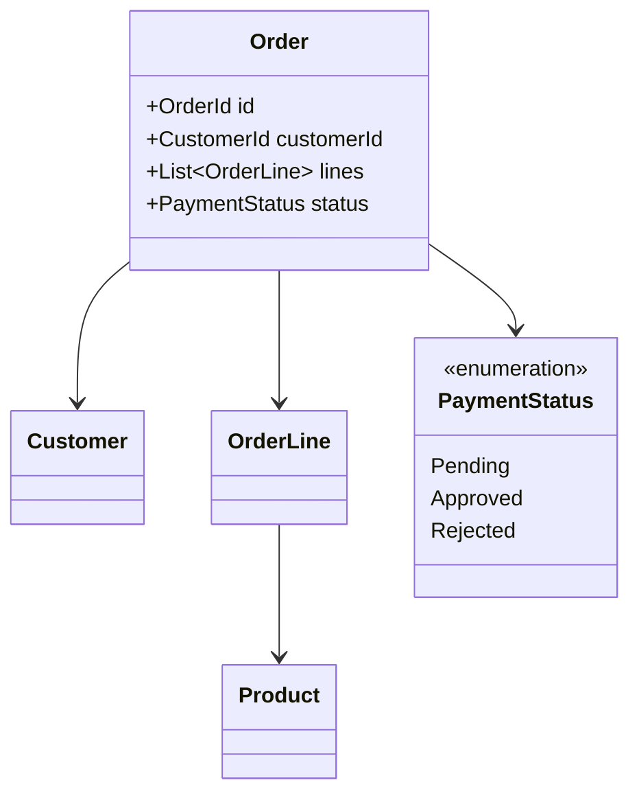
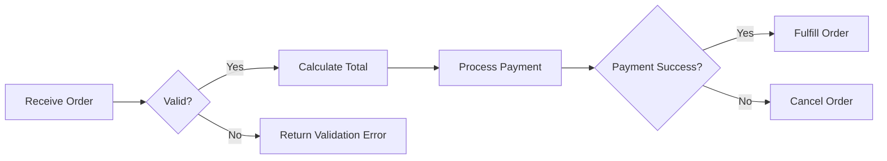
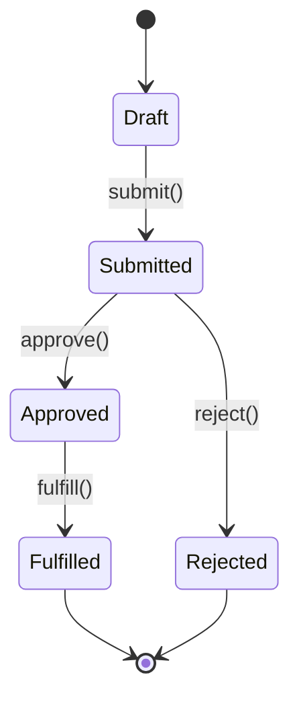
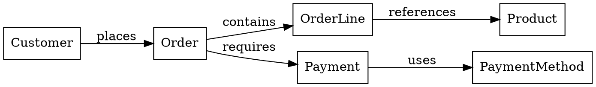

# Domain-Driven Design

## Overview

This skill provides guidance for domain modeling based on Rich Hickey's data-oriented design principles and Scott Wlaschin's type-driven design approach. Focus on building systems that make illegal states unrepresentable, prioritize data and transformations over objects and methods, and establish a ubiquitous language that bridges technical implementation and business domain.

## Core Principles

### Rich Hickey's Data-Oriented Design

**Simplicity over Ease**
- Favor simple constructs that can be understood independently
- Avoid complecting (intertwining) unrelated concerns
- Separate policy from mechanism, data from behavior

**Data is King**
- Model the domain using pure data structures, not objects with behavior
- Prefer generic data structures (maps, sets, vectors) over custom classes when appropriate
- Data should be self-describing and inspectable
- Functions transform data; data does not execute behavior

**Value of Values**
- Use immutable values to represent facts
- Values enable local reasoning and simple equality
- Values can be freely shared without coordination
- Consider: what are the immutable facts in this domain?

**Decomplecting**
- Identify what is truly essential to the domain vs. incidental complexity
- Separate when-it-happens from what-happens
- Separate mechanism from policy
- Question: are these concerns actually separate, or have we tangled them?

### Scott Wlaschin's Type-Driven Design

**Make Illegal States Unrepresentable**
- Use the type system to eliminate invalid states at compile time
- Model optional values explicitly (Option/Maybe types)
- Use sum types (discriminated unions) for states that are mutually exclusive
- Avoid primitive obsession; create domain-specific types

**Domain Modeling Made Functional**
- Model workflows as data transformations: Input → Process → Output
- Explicitly model business rules as functions
- Separate validation from business logic
- Think in terms of: What can happen? What are the valid transitions?

**Railway-Oriented Programming**
- Model success and failure paths explicitly (Result types)
- Chain operations that can fail using bind/flatMap
- Keep the happy path clear and linear
- Handle errors at appropriate boundaries

**Types as Documentation**
- Type signatures should communicate intent
- Use newtype wrappers for semantic clarity (UserId, EmailAddress, Timestamp)
- Constrain inputs to valid ranges using types
- Let the type system guide API design

## DDD Building Blocks

### Entities vs Value Objects

**Entities** are defined by identity, not attributes:
- Have a unique identifier (ID, account number, etc.)
- Can change over time while maintaining identity
- Two entities with same attributes but different IDs are distinct
- Used when domain experts refer to things by name/ID

**Value Objects** are defined entirely by attributes:
- No unique identifier
- Immutable
- Two value objects with same attributes are interchangeable
- Used when only the value matters, not identity

**Decision Guide:**
- Ask: Do domain experts refer to this by ID/name? → Entity
- Ask: Can I replace it with an equivalent copy? → If yes: Value Object

### Aggregates and Aggregate Roots

**Aggregate**: A cluster of entities and value objects treated as a single unit for data changes.

**Aggregate Root**: The single entity through which all external access to the aggregate must pass.

**Purpose:**
- Define transactional consistency boundaries
- Enforce invariants that span multiple objects
- Simplify the model by grouping related concepts

**Rules:**
- External references go only to the aggregate root (use ID references)
- Root enforces all invariants for the entire aggregate
- Transactions don't cross aggregate boundaries (use eventual consistency)
- Keep aggregates small for better performance and scalability

**When NOT to create an aggregate:**
- Objects can be modified independently
- No shared invariants requiring transactional consistency
- Different objects have different lifecycles

### Bounded Contexts

**Definition**: An explicit boundary within which a domain model applies.

**Purpose:**
- Divide large domains into manageable pieces
- Allow same term to have different meanings in different contexts
- Prevent model corruption from mixing incompatible concepts

**Key Insight**: Ubiquitous language is only ubiquitous within a context. "Customer" in Sales context may be different from "Customer" in Shipping context.

**When modeling:**
- Identify which bounded context you're in
- Make context boundaries explicit in code structure (separate modules/namespaces)
- Use anti-corruption layers when integrating across contexts
- Document relationships between contexts (context map)

### Domain Events

**Definition**: Something important that happened in the domain.

**Characteristics:**
- Named in past tense (OrderPlaced, PaymentProcessed, UserRegistered)
- Immutable facts
- Domain experts care about them
- Can trigger reactions within or across bounded contexts

**Uses:**
- Decouple domain logic
- Enable eventual consistency between aggregates
- Integration between bounded contexts
- Event sourcing (store events as source of truth)

### Repositories

**Purpose**: Provide illusion of an in-memory collection of aggregates, abstracting persistence.

**Characteristics:**
- Operate at aggregate boundaries (load/save whole aggregates)
- Provide lookup by ID
- Hide database implementation details
- Return domain entities, not database rows

**Pattern**: Application layer uses repository to get/save aggregates; domain layer remains pure.

## Domain Modeling Workflow

### 1. Discover the Ubiquitous Language

Start by identifying the domain concepts, using terminology from domain experts:

**Action Items:**
- List nouns (entities, value objects) and verbs (operations, events) from the domain
- Document domain terms with precise definitions
- Identify synonyms and resolve ambiguity
- Ask: What does the business call this? What are the boundaries of this concept?

**Output Format:**
Create a glossary section documenting each term:
```markdown
**Term** (Type: Entity/ValueObject/Event/Command)
- Definition: [Clear, domain-expert-approved definition]
- Examples: [Concrete examples]
- Invariants: [Rules that must always hold]
```

### 2. Analyze the Existing Domain Model

Before making changes, understand the current state:

**Exploration Steps:**
- Identify where domain concepts are currently modeled (types, schemas, tables)
- Map out relationships between domain entities
- Find where business logic lives (services, functions, stored procedures)
- Document implicit rules and constraints
- Note inconsistencies in naming or modeling

**Questions to Answer:**
- What types/classes represent domain concepts?
- What are the invariants? Where are they enforced?
- Which concepts are tangled together that should be separate?
- Are there phantom types or states that shouldn't exist?

### 3. Identify Inconsistencies and Smells

Common problems to surface:

**Naming Inconsistencies**
- Same concept with different names (User vs Account vs Customer)
- Different concepts with same name (Order as entity vs Order as command)
- Technical names bleeding into domain language (DTO, DAO suffixes)

**Structural Problems**
- Illegal states being representable (e.g., `status: "approved" | "rejected"` with separate `approved_at` and `rejected_at` fields that can both be set)
- Primitive obsession (strings for email, numbers for money)
- Optional fields that are actually required in certain states
- Null/undefined used to represent multiple distinct states

**Complected Concerns**
- Domain logic mixed with infrastructure (DB access in business logic)
- Multiple responsibilities in one type/module
- Temporal coupling (must call A before B or system breaks)

**Missing Concepts**
- Domain concepts that exist in conversations but not in code
- Implicit states that should be explicit
- Business rules enforced through comments or conventions rather than types

### 4. Design the Domain Model

Apply type-driven and data-driven principles:

**Data Modeling:**
- Start with the data shape; what are the facts?
- Use immutable values for facts that don't change
- Model state transitions explicitly
- Separate identity from attributes
- Consider: what varies together? What varies independently?

**Type Design:**
- Create sum types for mutually exclusive states:
  ```
  type PaymentStatus =
    | Pending
    | Approved { approvedAt: Timestamp, approvedBy: UserId }
    | Rejected { rejectedAt: Timestamp, reason: string }
  ```
- Use product types to ensure all required data is present
- Create semantic wrappers for primitives:
  ```
  type EmailAddress = EmailAddress of string  // with validation
  type Money = { amount: Decimal, currency: Currency }
  ```
- Make impossible states unrepresentable

**Workflow Modeling:**
- Model each business workflow as a clear pipeline:
  ```
  ValidateInput → ExecuteBusinessLogic → HandleResult → Persist → Notify
  ```
- Identify decision points and model them explicitly
- Separate pure business logic from effects (IO, time, randomness)
- Use clear function signatures that document intent

### 5. Build and Maintain Ubiquitous Language

**Consistency Rules:**
- Use identical terminology in code, documentation, conversations, and UI
- When domain language changes, update all representations
- Avoid technical jargon in domain code (no "factory", "manager", "handler" unless domain terms)
- Resist the temptation to rename domain concepts for technical convenience

**Code Conventions:**
- Domain types should mirror domain language exactly
- Function names should use domain verbs
- Module boundaries should follow domain boundaries
- Comments should explain domain rules, not implementation details

**Documentation:**
- Keep the glossary up to date
- Document why decisions were made (especially constraints and invariants)
- Link code to domain documentation
- Make implicit domain rules explicit

### 6. Visualize the Domain Model

Use diagrams to communicate domain structure and relationships:

**Mermaid for Relationships:**


**Mermaid for Workflows:**


**Mermaid for State Transitions:**


**Graphviz/DOT for Complex Relationships:**


**ASCII for Quick Sketches:**
```
Customer
  └─> Order (1:N)
       ├─> OrderLine (1:N)
       │    └─> Product
       └─> Payment (1:1)
            └─> PaymentMethod
```

**When to Use Each:**
- **Mermaid classDiagram**: Entity relationships and type structures
- **Mermaid graph/flowchart**: Business workflows and decision trees
- **Mermaid stateDiagram**: State transitions and lifecycle
- **Graphviz/DOT**: Complex dependency graphs, module boundaries
- **ASCII**: Quick sketches during discussion, simple hierarchies

## Domain Modeling Anti-Patterns

**Anemic Domain Model**
- Symptom: Data structures with getters/setters, all logic in separate services
- Problem: Violates data-orientation by adding ceremony without encapsulation benefits
- Solution: Keep data as data; put related transformations in same module but separate from data definition

**Entity Services Anti-Pattern**
- Symptom: Classes like `UserService`, `OrderManager`, `ProductFactory`
- Problem: Hides actual operations; lacks ubiquitous language
- Solution: Name functions after domain operations: `approveOrder`, `cancelSubscription`, `calculateDiscount`

**Primitive Obsession**
- Symptom: String for email, number for money, boolean flags for states
- Problem: No type safety; invalid values representable
- Solution: Create semantic types with validation

**Accidental Complexity**
- Symptom: Complex abstractions, design patterns without clear domain benefit
- Problem: Adds layers that obscure domain meaning
- Solution: Simplify; prefer composition over inheritance; avoid premature abstraction

**Hidden Temporal Coupling**
- Symptom: Must call methods in specific order or system breaks
- Problem: Complects workflow with state management
- Solution: Make workflow explicit; use types to enforce valid transitions

**Boolean Blindness**
- Symptom: Boolean flags to represent states (isApproved, isActive, isDeleted)
- Problem: Multiple booleans can represent impossible states
- Solution: Use sum types for mutually exclusive states

## Contextualizing Within Existing Models

When adding to or changing an existing domain model:

1. **Map Current State**: Document existing types, relationships, and patterns
2. **Identify Affected Concepts**: Which existing concepts does this change touch?
3. **Check Consistency**: Does new design follow existing patterns? If not, why?
4. **Assess Impact**: What breaks if we make this change?
5. **Migration Path**: How do we evolve from current to desired state?
6. **Update Ubiquitous Language**: Ensure all usage points are updated
7. **Visualize Before/After**: Create diagrams showing current and proposed models

**Key Questions:**
- Does this change align with existing domain boundaries?
- Are we using consistent terminology?
- Does this introduce new concepts or reuse existing ones?
- Are we fixing an inconsistency or introducing a new one?
- Can we make this change incrementally?

## Checklist for Domain Modeling

Before completing domain modeling work:

**Language & Communication:**
- [ ] All domain concepts are named using ubiquitous language
- [ ] Domain glossary is updated with new/changed terms
- [ ] All code, docs, and conversations use identical terminology
- [ ] Bounded context is clearly identified and documented

**Type Design:**
- [ ] Types make illegal states unrepresentable
- [ ] No primitive obsession; semantic types are used appropriately
- [ ] Entities have clear identity; value objects are immutable
- [ ] Sum types used for mutually exclusive states

**Domain Logic:**
- [ ] Business rules are explicit and testable
- [ ] Data and behavior are appropriately separated
- [ ] Workflows are modeled as clear data transformations
- [ ] Domain logic is pure (no side effects)
- [ ] Temporal coupling is eliminated or made explicit

**Aggregates & Boundaries:**
- [ ] Aggregate boundaries are explicit
- [ ] Aggregates enforce their invariants
- [ ] External references to aggregates use IDs only
- [ ] Aggregates are kept small and focused
- [ ] Transactional boundaries are appropriate

**Consistency & Integration:**
- [ ] Inconsistencies with existing model are resolved or documented
- [ ] Cross-aggregate consistency strategy is defined (transactional vs eventual)
- [ ] Domain events are used for important occurrences
- [ ] Integration between bounded contexts uses anti-corruption layers

**Documentation:**
- [ ] Visualization diagrams clearly communicate the design
- [ ] Key decisions and invariants are documented
- [ ] Context map shows relationships between bounded contexts

## Resources

### references/

This skill includes reference documentation for deeper exploration:

- **ddd_foundations_and_patterns.md**: Eric Evans' foundational DDD concepts (entities, value objects, aggregates, bounded contexts, repositories, domain events), Martin Fowler's Ubiquitous Language guidance, and practical Clojure/functional patterns. Essential reading for understanding DDD building blocks and how to apply them.

- **rich_hickey_principles.md**: Core concepts from Rich Hickey's talks including Simple Made Easy, Value of Values, and The Language of the System. Focus on data-oriented design, simplicity, decomplecting, and the power of immutable values.

- **wlaschin_patterns.md**: Scott Wlaschin's type-driven design patterns, domain modeling recipes, functional architecture guidance, and railway-oriented programming. Emphasis on making illegal states unrepresentable and designing with types.

- **visualization_examples.md**: Comprehensive examples of Mermaid, Graphviz, and ASCII diagram patterns for domain modeling. Includes entity relationships, workflows, state machines, aggregate boundaries, and bounded context maps.

Load these references when deeper context is needed on specific principles or patterns.
