# Domain Modeling Visualization Examples

This reference provides comprehensive examples of using Mermaid, Graphviz/DOT, and ASCII diagrams for domain modeling visualization.

## When to Use Each Format

| Format | Best For | Strengths | Limitations |
|--------|----------|-----------|-------------|
| **Mermaid** | Quick diagrams, workflows, state machines | Easy syntax, widely supported, good for communication | Limited layout control |
| **Graphviz/DOT** | Complex relationships, dependency graphs | Powerful layout algorithms, precise control | More verbose syntax |
| **ASCII** | Quick sketches, simple hierarchies, inline docs | Immediately readable in any editor, minimal | Limited visual appeal, simple structures only |

## Mermaid Diagrams

### Class Diagrams for Domain Entities

**Use for:** Showing entity relationships and structure

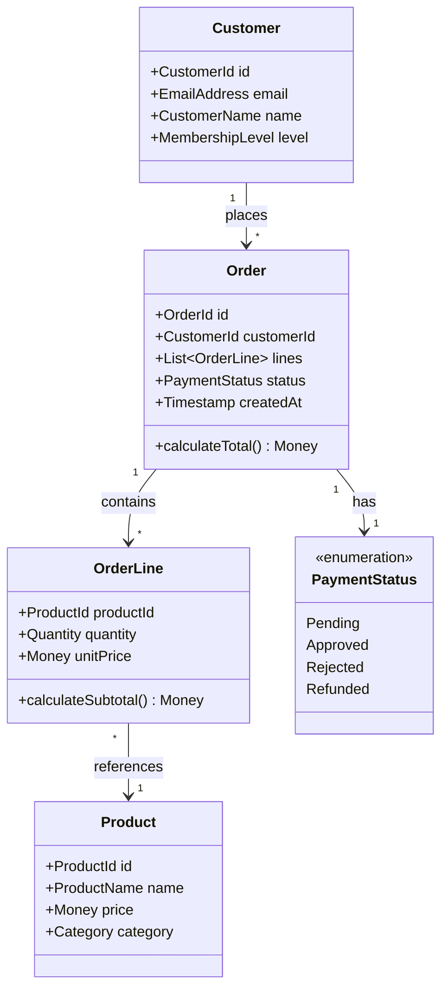

**With generics and constraints:**

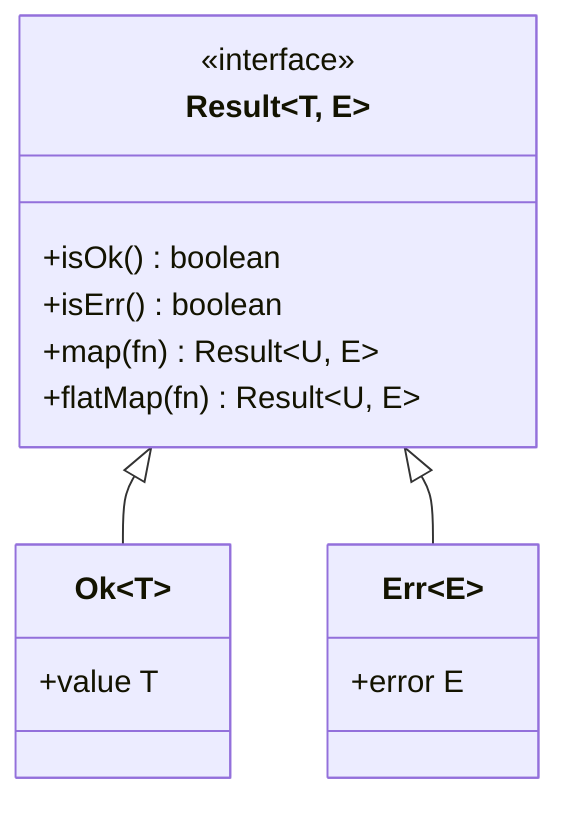

### Flowcharts for Business Workflows

**Use for:** Showing decision points and process flow

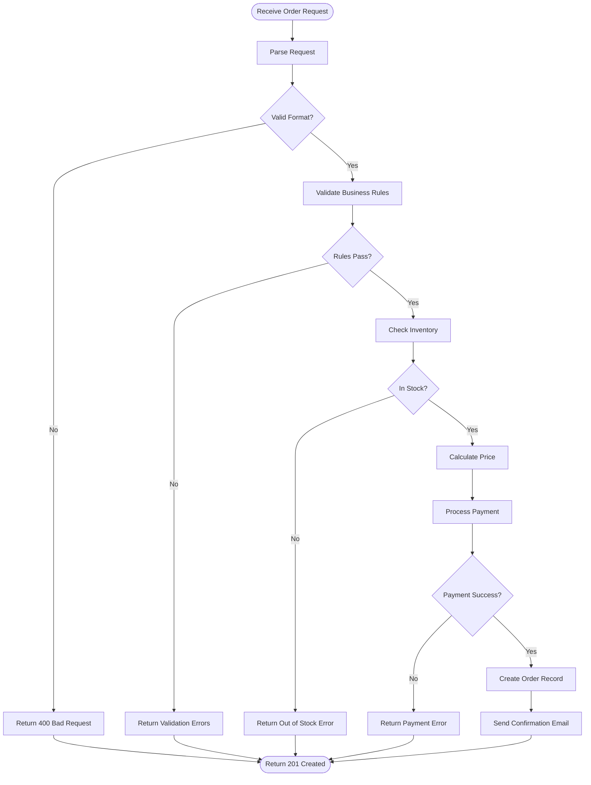

**Railway-oriented programming pattern:**

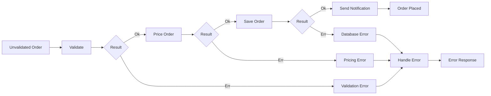

### State Diagrams for Lifecycle Modeling

**Use for:** Showing valid state transitions

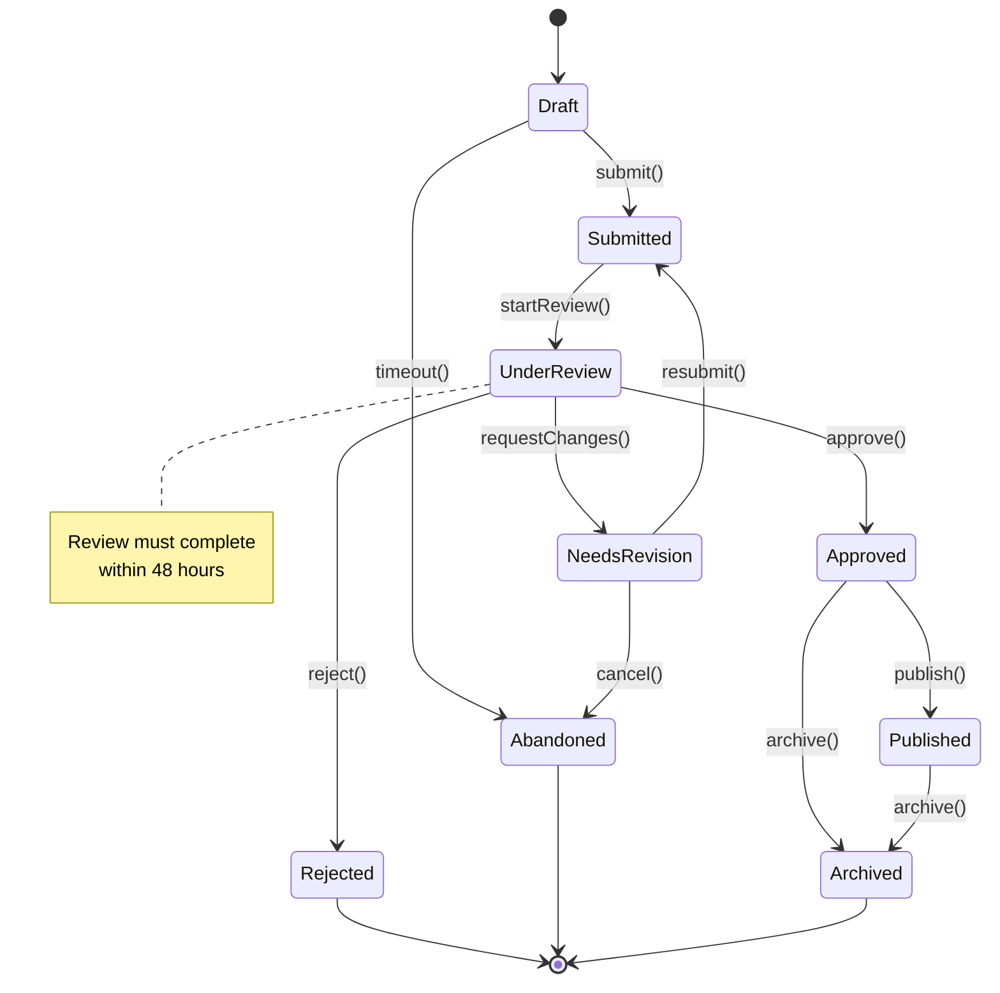

**With nested states:**

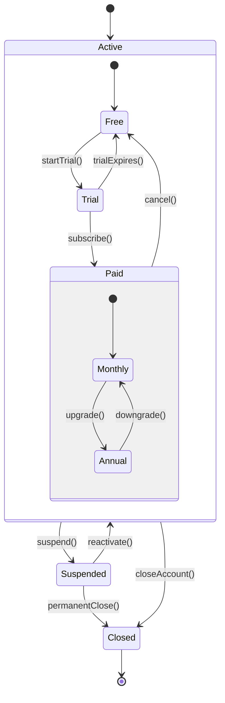

### Sequence Diagrams for Interactions

**Use for:** Showing message flow between components

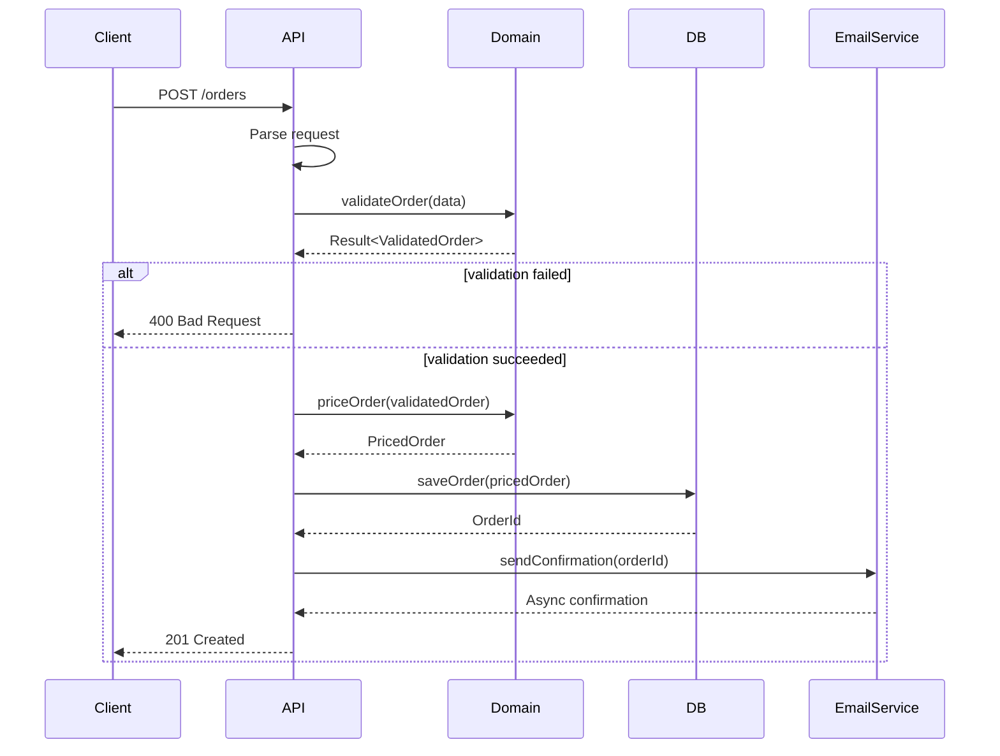

### Entity Relationship Diagrams

**Use for:** Database schema or aggregate boundaries

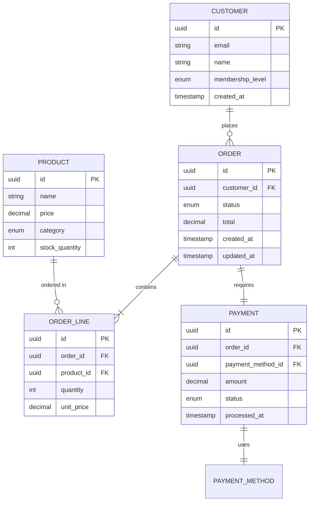

### Gantt Charts for Project Planning

**Use for:** Timeline and dependency visualization

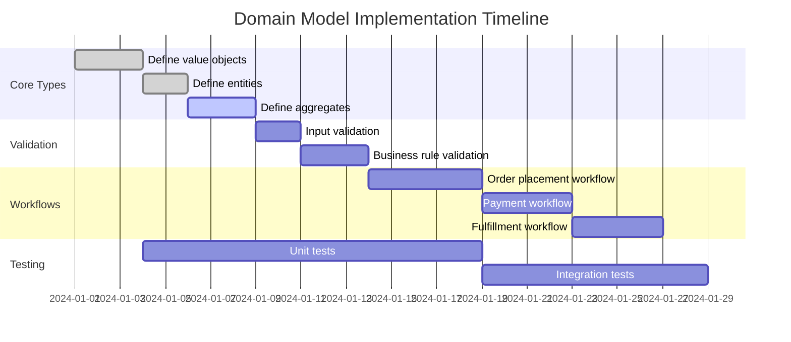

## Graphviz/DOT Diagrams

### Complex Dependency Graphs

**Use for:** Module dependencies, complex relationships

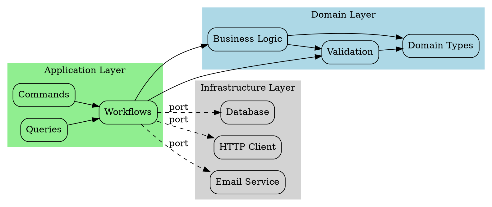

### Aggregate Boundaries

**Use for:** DDD aggregates and bounded contexts

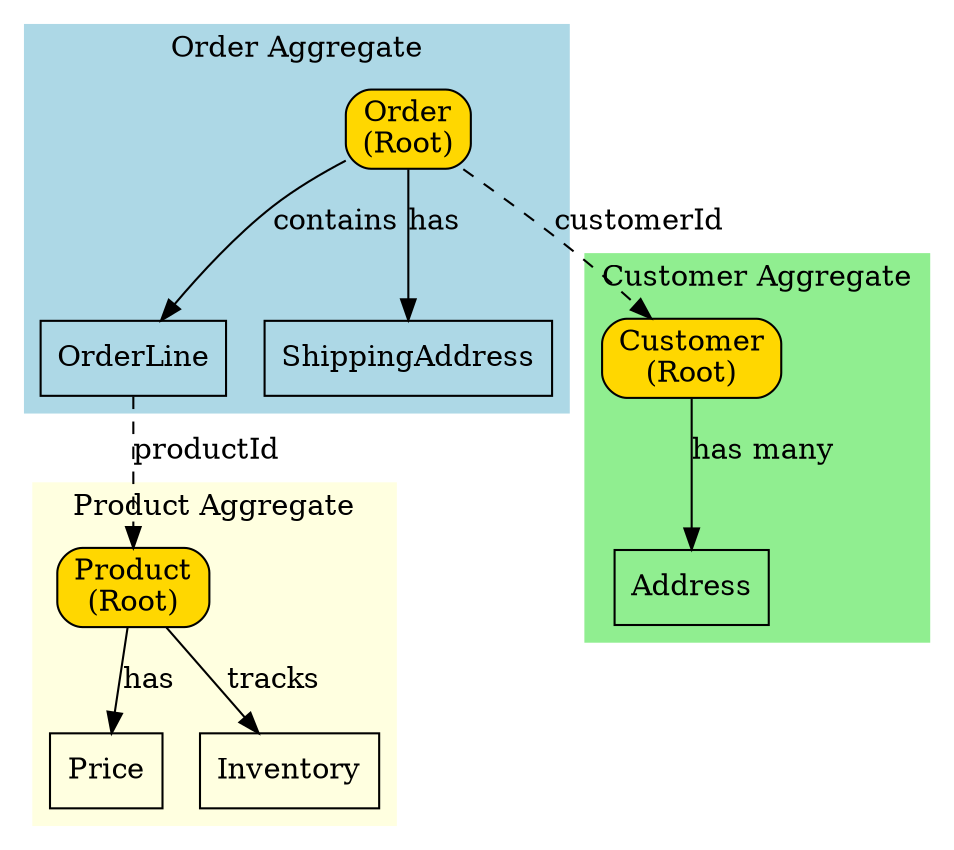

### Layered Architecture

**Use for:** Showing architectural layers and flow

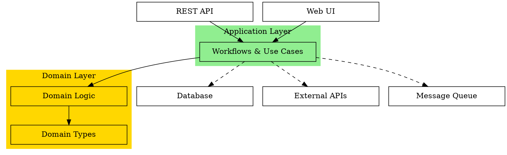

### Data Flow Diagrams

**Use for:** Showing how data moves through the system

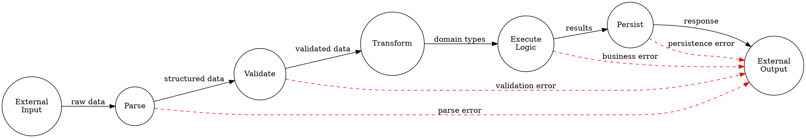

## ASCII Diagrams

### Simple Hierarchies

**Use for:** Quick sketches, documentation, inline comments

```
Domain Model Hierarchy
======================

Order (Aggregate Root)
  ├─> OrderId (Value Object)
  ├─> CustomerId (Value Object)
  ├─> OrderStatus (Enum)
  │    ├─ Draft
  │    ├─ Submitted
  │    ├─ Approved
  │    └─ Fulfilled
  ├─> OrderLines (Collection)
  │    └─> OrderLine
  │         ├─> ProductId
  │         ├─> Quantity
  │         └─> UnitPrice
  └─> PaymentInfo
       ├─> PaymentMethod
       └─> PaymentStatus
```

### Relationships

```
Customer Relationships
=====================

Customer (1) ────places────> (*) Order
                                  │
                                  ├── contains ──> (*) OrderLine
                                  │                     │
                                  │                     └── references ──> (1) Product
                                  │
                                  └── requires ──> (1) Payment
                                                       │
                                                       └── uses ──> (1) PaymentMethod
```

### State Transitions

```
Order Lifecycle
===============

    ┌───────┐
    │ Draft │
    └───┬───┘
        │ submit()
        v
    ┌─────────┐
    │Submitted│
    └────┬────┘
         │
         ├── approve() ────> ┌────────┐
         │                    │Approved│
         │                    └────┬───┘
         │                         │ fulfill()
         │                         v
         │                    ┌─────────┐
         │                    │Fulfilled│────> [END]
         │                    └─────────┘
         │
         └── reject() ─────> ┌────────┐
                              │Rejected│────> [END]
                              └────────┘
```

### Data Flow

```
Order Placement Pipeline
========================

Unvalidated     Validated       Priced         Saved
Order       =>  Order       =>  Order      =>  Order      => Event
   │               │               │               │           │
   └─ validate() ──┘               │               │           │
                   └─ priceOrder() ┘               │           │
                                   └─ saveOrder() ─┘           │
                                                   └─ notify() ┘

Errors:
   ValidationError ─┐
   PricingError ────├──> ErrorHandler ──> ErrorResponse
   DatabaseError ───┘
```

### Component Boxes

```
┌─────────────────────────────────────────────┐
│          Order Management Domain            │
├─────────────────────────────────────────────┤
│                                             │
│  ┌──────────────┐      ┌─────────────────┐ │
│  │   Commands   │      │     Queries     │ │
│  ├──────────────┤      ├─────────────────┤ │
│  │ PlaceOrder   │      │ GetOrder        │ │
│  │ CancelOrder  │      │ ListOrders      │ │
│  │ ApproveOrder │      │ GetOrderHistory │ │
│  └──────────────┘      └─────────────────┘ │
│         │                      │            │
│         v                      v            │
│  ┌──────────────────────────────────────┐  │
│  │        Domain Logic                  │  │
│  │  ┌────────────┐   ┌───────────────┐ │  │
│  │  │ Validation │   │ Business Rules│ │  │
│  │  └────────────┘   └───────────────┘ │  │
│  └──────────────────────────────────────┘  │
│                                             │
└─────────────────────────────────────────────┘
```

### Matrix/Table Layouts

```
State Transition Matrix
=======================

From/To     │ Draft │ Submitted │ Approved │ Rejected │ Fulfilled
────────────┼───────┼───────────┼──────────┼──────────┼──────────
Draft       │   -   │    Yes    │    No    │    No    │    No
Submitted   │  No   │     -     │   Yes    │   Yes    │    No
Approved    │  No   │    No     │    -     │    No    │   Yes
Rejected    │  No   │    No     │    No    │    -     │    No
Fulfilled   │  No   │    No     │    No    │    No    │    -
```

### Layered Architecture

```
Layered Architecture
====================

┌────────────────────────────────────────┐
│      Presentation Layer (API)          │  ← HTTP, JSON, Auth
├────────────────────────────────────────┤
│      Application Layer                 │  ← Workflows, Use Cases
│  ┌──────────────┐  ┌────────────────┐ │
│  │ Order Mgmt   │  │ Customer Mgmt  │ │
│  └──────────────┘  └────────────────┘ │
├────────────────────────────────────────┤
│      Domain Layer                      │  ← Pure Business Logic
│  ┌──────┐  ┌────────┐  ┌───────────┐ │
│  │Types │  │Validation│ │ Business  │ │
│  │      │  │          │  │  Rules    │ │
│  └──────┘  └────────┘  └───────────┘ │
├────────────────────────────────────────┤
│      Infrastructure Layer              │  ← DB, External APIs
│  ┌──────────┐  ┌──────────┐  ┌──────┐│
│  │ Database │  │   HTTP   │  │Email ││
│  └──────────┘  └──────────┘  └──────┘│
└────────────────────────────────────────┘
```

## Choosing the Right Visualization

### Decision Matrix

| Need | Recommended Format | Reason |
|------|-------------------|---------|
| Show entity relationships | Mermaid classDiagram or ER diagram | Clear, standard notation |
| Show business workflow | Mermaid flowchart | Easy to follow decision paths |
| Show state machine | Mermaid stateDiagram | Built-in state diagram support |
| Show message flow | Mermaid sequence diagram | Temporal ordering clear |
| Show module dependencies | Graphviz/DOT | Better layout for complex graphs |
| Show architectural layers | Graphviz/DOT or ASCII | Clear separation of concerns |
| Quick sketch in docs | ASCII | Works everywhere, minimal |
| Inline code comments | ASCII (simple) | Readable in source code |

### Complexity Guidelines

**Simple (1-5 entities/states):**
- ASCII often sufficient
- Quick to create and modify

**Medium (6-15 entities/states):**
- Mermaid recommended
- Good balance of features and simplicity

**Complex (15+ entities/states):**
- Graphviz/DOT for maximum control
- Or break into multiple simpler diagrams

### Communication Context

**For developers:**
- Any format works
- Prefer precision over aesthetics
- Include technical details

**For stakeholders:**
- Mermaid flowcharts (intuitive)
- Avoid technical jargon in labels
- Focus on business concepts

**For documentation:**
- Mermaid (renders in Markdown viewers)
- ASCII for inline code comments
- Include both high-level and detailed views

## Tips and Best Practices

### General Principles

1. **Start simple** - Add complexity only as needed
2. **Use consistent naming** - Match code/domain language exactly
3. **Show relationships clearly** - Label edges meaningfully
4. **Group related concepts** - Use subgraphs/clusters
5. **Highlight important paths** - Use color/style for emphasis
6. **Keep it readable** - Don't cram too much in one diagram

### Mermaid Tips

- Use meaningful IDs (not just A, B, C)
- Add notes for important details
- Use subgraphs for grouping
- Set direction (TD, LR) for best layout

### Graphviz Tips

- Use `rankdir` to control flow direction
- Use `subgraph cluster_*` for grouping
- Use `style=filled` and `color` for visual hierarchy
- Use edge styles (solid, dashed, dotted) to show relationship types

### ASCII Tips

- Use box-drawing characters for cleaner look: ┌─┐│└┘├┤┬┴┼
- Keep lines aligned for readability
- Use indentation to show hierarchy
- Add whitespace for visual separation

### Version Control Friendly

All three formats are text-based and work well with git:
- Easy to diff
- Easy to review in PRs
- Easy to search
- No binary files to worry about

## Templates

### Quick Reference Template

```
Domain: [Domain Name]
====================

Key Entities:
- [Entity1]: [Brief description]
- [Entity2]: [Brief description]

Relationships:
[Entity1] ──> [Entity2]: [relationship description]

States:
[Entity] can be in: [State1] → [State2] → [State3]

Workflows:
1. [Workflow Name]: [Input] → [Step1] → [Step2] → [Output]
```

Use these visualization patterns to clearly communicate domain models and facilitate shared understanding among team members and stakeholders.
